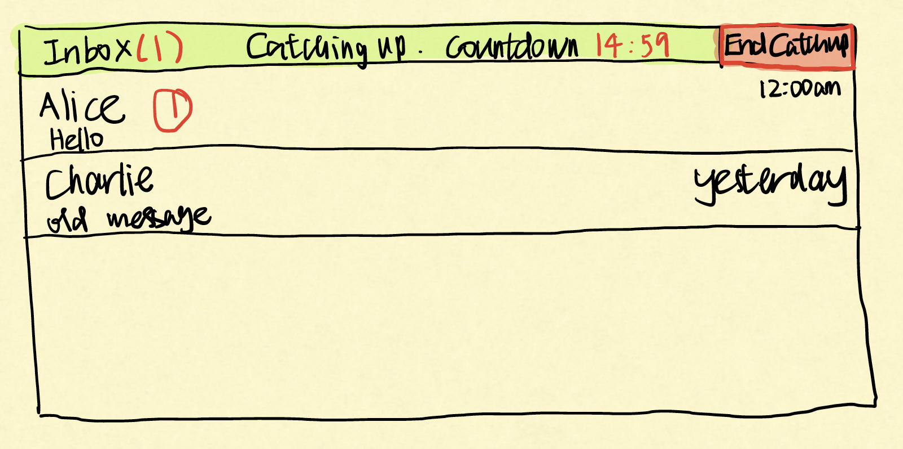
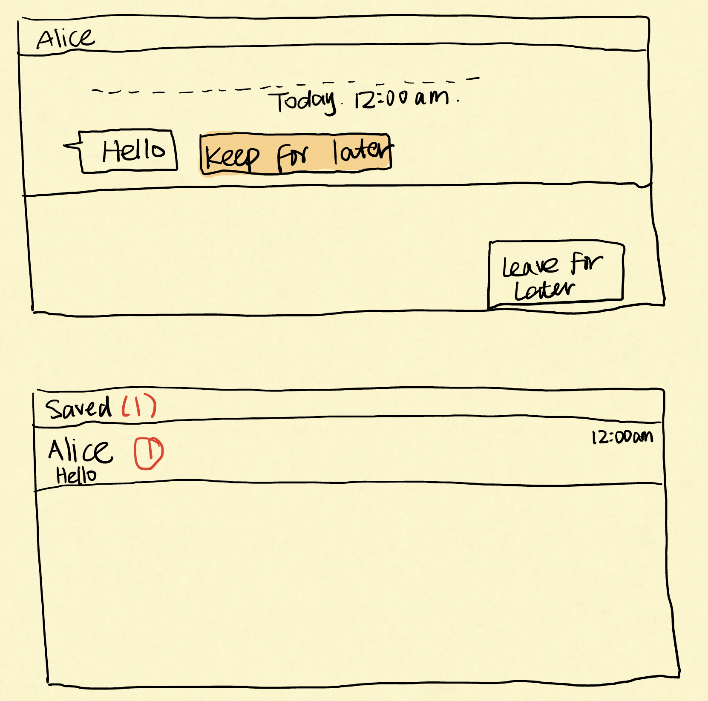

# Catchup

**Share when you think of it. Catch up when you choose.**

MIT 6.1040 · Fall 2026 · Personal Project · [P1: Design](https://61040.github.io/fa26/assignments/personal-project/#p1-design)

Catchup is a private space for existing friends to exchange non-urgent messages and links. Senders capture a share immediately; recipients choose when pending shares become available and can save messages they want to revisit. The proposed benefit is preserving wanted exchanges while letting recipients choose when to engage. Its usefulness compared with existing messaging tools remains to be tested.

## Contents

- [Problem framing and stakeholders](#problem-framing-and-stakeholders)
- [Application pitch](#application-pitch)
- [Concept design](#concept-design)
- [UI sketches](#ui-sketches)
- [User journey](#user-journey)
- [Evaluation plan](#evaluation-plan)

## Problem framing and stakeholders

### Domain

Casual, asynchronous communication between existing friends. People share small life updates, jokes, and interesting links to maintain their connection. These exchanges are not time-sensitive: the moment someone thinks of sharing something may differ from the moment their friend wants to read it. Receiving a message does not require an immediate reply or imply that both people are available for a live conversation.

### Bad situations

**Postponed sharing is forgotten.** Late at night, Alice finds a post she wants to send Bob. She is unsure whether sending it would disturb him, so she saves it and plans to send it tomorrow. The next day she forgets. A share she wanted to make never reaches her friend. Waiting avoids a possible interruption but leaves Alice responsible for remembering another task.

**An intention to revisit is lost.** Bob encounters a message while occupied and wants to return to it with more attention. Later, he forgets which exchange he intended to revisit. The desired follow-up is lost among other activity. This is a design hypothesis: the evidence below supports forgotten checking, but does not establish this entire sequence or how frequently it occurs.

**Awareness of an unread message disrupts concentration.** Bob notices a new-message indicator while doing homework. He returns to his work without opening the message, but repeatedly wonders what his friend sent, making it harder to regain his train of thought. This is another situation to investigate; the sources below do not yet corroborate it.

The intended users are friends who experience these difficulties despite their existing arrangements. The problem is not universal. Someone comfortable sending at any hour, or whose scheduled sending, notification settings, and checking routines already meet their needs, may have little reason to use Catchup.

### Corroboration and its limits

In a [Reddit discussion of scheduled texting](https://www.reddit.com/r/NoStupidQuestions/comments/ss50c9/why_cant_you_schedule_texts_to_go_out_at_a_later/), the author describes saving posts instead of sending them at 2 a.m., then forgetting to share them. The author acknowledges Apple Shortcuts as a workaround. Other commenters describe being comfortable receiving messages at any hour or reluctant to adopt another messaging app. This historical account illustrates postponed sharing; it does not establish that scheduling is unavailable today or that Catchup is necessary.

In a [discussion of Do Not Disturb](https://www.reddit.com/r/ios/comments/mr2rzt/do_not_disturb/), a commenter reports forgetting to check missed notifications manually. This supports investigating forgotten checking. It does not establish that someone read a friend's message, intended a considered response, and then forgot that intention. The reported device behavior is historical, not a claim about current iOS.

No interviews or trials have been conducted for this design. The second and third situations and the benefit of recipient-initiated catch-up need further evidence. The distraction scenario does not establish an advantage over muting chats or hiding notification indicators; these alternatives belong in the evaluation.

### Workarounds and comparables

| Existing approach | What it already provides | Question remaining for Catchup |
|---|---|---|
| Wait to send | The sender avoids sending at an unwelcome moment. | Can immediate capture reduce the effort of remembering to share later? |
| [iMessage Send Later](https://support.apple.com/guide/iphone/schedule-a-text-message-to-send-later-iph5ae9a7be6/26/ios/26) | Scheduled delivery at a sender-selected time, up to 14 days ahead. | Is a recipient-selected receiving moment more useful than a scheduled time? |
| Muting, Focus, and [Scheduled Summary](https://support.apple.com/guide/iphone/change-notification-settings-iph7c3d96bab/ios) | Control over interruptions; selected notifications can be summarized at chosen times. | Does Catchup add enough value beyond checking an existing muted chat? |
| [Telegram Send When Online](https://telegram.org/blog/verifiable-apps-and-more) | Delivery when the recipient comes online, where their online status is visible to the sender. | Does explicitly choosing to catch up differ meaningfully from coming online? |
| [Apple message tracking](https://support.apple.com/guide/iphone/keep-track-of-messages-iphe9b48b89e/ios) and [Slack saved messages](https://slack.com/help/articles/360042650274-Save-messages-and-files-for-later) | Existing ways to preserve conversations or messages for later attention. | Does combining saved items with recipient-initiated receiving make returning easier? |

None of Catchup's individual components is claimed to be unprecedented. The proposal combines a channel understood as non-urgent, explicit receiving windows, and private saved items. A notification plugin could address much of the original interruption problem and might implement similar behavior. Keeping pending items on a server is not, by itself, a reason to prefer this app.

Catchup would complement the friends' existing communication tools. One pair could try it without moving their wider social network. Nevertheless, an additional channel creates effort, and that cost must be evaluated.

### Stakeholders

- **Sender:** Wants to capture a share when they think of it, with confirmation that it has been saved and an understandable account of when it becomes available.
- **Recipient:** Wants control over when new shares appear and an easy way to retain messages they want to revisit.
- **People sharing the recipient's attention:** Classmates, colleagues, or companions may benefit if the recipient chooses an appropriate time to catch up. They do not interact with the app.

Sender and recipient are roles. Each participant occupies both roles at different times.

## Application pitch

### Catchup: Share when you think of it. Catch up when you choose.

Friends sometimes postpone a casual share or lose track of something they wanted to return to. Catchup gives an existing pair of friends a dedicated place to preserve those exchanges.

**Leave for later.** Write a short update or share a link as soon as it comes to mind. Catchup confirms that it has been saved for the recipient. The sender does not choose a delivery time or need to remember to send it again.

**Catch up now.** The recipient deliberately opens a 15-minute receiving window. Pending messages appear together, grouped by friend, and new messages arriving during that window become available too. Signing in or browsing old exchanges does not open a window. Recipients can end it early.

**Keep for later.** Save a received message to a private list and reopen the original message later. Remove it from that list when it no longer needs attention. Saving is available without committing to a response.

Catchup is for non-urgent exchanges. Time-sensitive questions and everyday logistics stay in the friends' existing channels. It does not promise a live conversation, faster replies, or fewer messages to read. The question is whether this workflow preserves wanted exchanges well enough to justify another app.

## Concept design

### Scope and behavior

- The initial deployment is a small trial among existing friends who exchange usernames. The design has no public feed, contact discovery, group chats, or contact-approval system; it does not claim to prevent stranger contact or spam.
- Messages contain text and links, with a maximum of 2,000 characters. They are immutable after confirmation. Both participants use the same send action to continue an exchange.
- A receiving window starts only when its owner selects **Catch up now**. It lasts 15 minutes or ends when the owner selects **End catch-up**. Starting another window replaces the previous one.
- Readiness is not published as a presence indicator. A sender can see whether their own share is saved or available; this may indirectly reveal past catching-up activity.
- All pending items are released together when a window opens. Ending the window does not hide or delete previously released messages.
- Catchup provides no urgent override, forced release after a deadline, or out-of-app new-message alerts. The open inbox updates as messages are released, without one alert per message.
- While reception is closed, pending shares produce no recipient-facing previews, badges, or waiting-message counts. Previously released content remains accessible. This avoids revealing a new share's presence before the recipient chooses to catch up.
- Browsing history, sending, bookmarking, and signing in do not start receiving. Closing the browser does not itself end a window; the stop control and expiry determine its end.
- Message creation timestamps remain visible. A newly available message is not displayed as though it was just written.
- A bookmark records the recipient's intention to revisit an item. The design does not track read receipts or equate viewing with finishing.

### Concept specifications

The five concepts below own separate state. An external type in square brackets is an opaque identity: a concept may store and compare it, but cannot inspect properties owned by another concept.

Queries prefixed with an underscore read state without changing it. The clock supplies trusted current time; clients cannot choose timestamps. Failed preconditions prevent an action from occurring.

#### 1. PasswordAuthenticating

Reused from Exercise 2, parts 1–2, with the state and actions combined into one specification.

~~~text
concept PasswordAuthenticating
  purpose identify users; prevent one user from masquerading as another
  principle after a user registers with a username and a password,
    they can authenticate with that same username and password
    and be treated each time as the same user
  state
    a set of Users with
      a username
      a password
  actions
    register (username: String, password: String) : return (user: User)
      when username doesn't exist in state
      then create a new User with username and password
    authenticate (username: String, password: String) : return (user: User)
      when (username, password) in state
      then return corresponding User
~~~

Usernames are distinct, as established by register's condition. Passwords are abstract credentials in this specification; password hashing and secure transport are implementation responsibilities. Credentials are not included in message views.

#### 2. Messaging

~~~text
concept Messaging [User]
  purpose preserve the content of private exchanges

  principle a sender records a message for a recipient;
    its original text and creation time remain available;
    either participant can continue the exchange by sending a message

  state
    a set of Messages with
      a sender User
      a recipient User
      a text String
      a createdAt Time

  actions
    send(sender: User, recipient: User, text: String):
      returns (message: Message)
      where sender != recipient and trimmed text has 1–2,000 characters
      then create a message with these participants and text,
        createdAt = now; return message

  queries
    _get(message: Message): returns (record: optional MessageRecord)
      return its sender, recipient, text, and createdAt,
        or none if message does not exist

    _sent(user: User): returns (messages: set of Messages)
      return messages whose sender = user

    _addressedTo(user: User): returns (messages: set of Messages)
      return messages whose recipient = user
~~~

Messaging does not decide when a recipient may see a record. It also does not consult authentication, receiving windows, holding status, or bookmarks.

#### 3. Holding

~~~text
concept Holding [Recipient, Item]
  purpose retain items until their release is explicitly authorized

  principle enqueueing an item for a recipient makes it pending;
    releasing it makes it available and keeps it available;
    repeated enqueueing or release does not create another copy

  state
    a set of Entries with
      a recipient Recipient
      an item Item
      a status PENDING or RELEASED
    at most one entry exists for each (recipient, item) pair

  actions
    enqueue(recipient: Recipient, item: Item)
      then create a PENDING entry if the pair is absent;
        otherwise leave state unchanged

    release(recipient: Recipient, items: set of Items):
      returns (released: set of Items)
      then set the recipient's PENDING entries for supplied items
        to RELEASED; return only the items changed by this action;
        unknown or already released pairs leave state unchanged

  queries
    _pending(recipient: Recipient): returns (items: set of Items)
      return items in this recipient's PENDING entries

    _released(recipient: Recipient): returns (items: set of Items)
      return items in this recipient's RELEASED entries

    _status(recipient: Recipient, item: Item):
      returns (status: PENDING, RELEASED, or ABSENT)
      return the pair's status, or ABSENT if it has no entry
~~~

Holding treats each Item as a handle. It neither reads message content nor decides whether someone is ready. Release authority comes from the application's reactions.

#### 4. Receptivity

~~~text
concept Receptivity [User]
  purpose let people explicitly limit periods in which they welcome reception

  principle a person opens a temporary receiving window;
    it remains open until they close it or its deadline passes;
    a replaced window's timer cannot close the newer window

  state
    a set of Windows with
      a unique person User
      a startedAt Time
      an expiresAt Time

  actions
    open(person: User): returns (window: Window)
      then remove any earlier window for person;
        create a fresh window with startedAt = now
        and expiresAt = now + 15 minutes; return window

    close(person: User, window: Window)
      then remove window if it is the current window for person;
        otherwise leave state unchanged

    expire(window: Window)
      then remove window if it still exists and now >= expiresAt;
        otherwise leave state unchanged

  queries
    _current(person: User): returns (window: optional Window)
      return the stored window for person, or none

    _isOpen(person: User): returns (open: Boolean)
      return true exactly when a window for person exists
        and now < its expiresAt
~~~

Expiry is effective even if the cleanup timer runs late: the readiness query compares the deadline with current time. Window handles are fresh, so an old close or expiry event cannot affect a replacement window.

#### 5. Bookmarking

~~~text
concept Bookmarking [User, Item]
  purpose keep items someone intends to revisit easy to find

  principle a person saves an item to their private list;
    it remains there until they remove it;
    repeated saving does not duplicate the item

  state
    a set of SavedPairs with
      a person User
      an item Item
    at most one saved pair exists for each (person, item)

  actions
    save(person: User, item: Item)
      then add the pair if absent; otherwise leave state unchanged

    remove(person: User, item: Item)
      then remove the pair if present; otherwise leave state unchanged

  queries
    _saved(person: User): returns (items: set of Items)
      return the items saved by person
~~~

Bookmarking does not inspect its items or determine who may save them. The application permits recipients to save only messages already released to them.

### Essential reactions

The reactions use the course's action-trigger, state-read, action-effect form. Requesting and Responding name the interface boundary, not additional domain concepts: requests represent authenticated UI operations, and responses return authorized views to the requester.

Each Requesting event below is an internal event emitted only after PasswordAuthenticating.authenticate accepts the request's credentials. Its first User argument is the identity returned by that action, supplied by the server rather than chosen by the client. Failed authentication or a failed guard rejects a request without changing domain state. Concept actions and raw queries are internal; clients access them only through these guarded requests.

#### Capture a new share

~~~text
reaction SendShare
  when Requesting.send(sender, recipientUsername, text)
  where PasswordAuthenticating: recipient is the User
    whose username = recipientUsername
  then Messaging.send(sender, recipient, text)

reaction HoldShare
  when Messaging.send(sender, recipient, text) returns message
  then Holding.enqueue(recipient, message)
~~~

The interface confirms successful capture after enqueueing completes. It labels the item **Saved for later** while pending and **Available** after release.

To respond to a friend, a participant sends another message with the sender and recipient reversed. A **Send to this friend** control can open the ordinary composer with the recipient filled in. The interface resolves the friend's username through PasswordAuthenticating's username association without exposing credentials. It uses the same SendShare and HoldShare reactions and does not open reception.

#### Explicitly open and close reception

~~~text
reaction StartCatchup
  when Requesting.startCatchup(person)
  then Receptivity.open(person)

reaction ReleasePending
  when Receptivity.open(person) returns window
  where
    Receptivity: window is current for person and _isOpen(person)
    Holding: items = _pending(person)
  then Holding.release(person, items)

reaction EndCatchup
  when Requesting.endCatchup(person, window)
  then Receptivity.close(person, window)

reaction ExpireWindow
  when the system clock reaches a stored window's deadline
  where Receptivity: window still exists and now >= window.expiresAt
  then Receptivity.expire(window)
~~~

The interface offers the end control only for the owner's current window. An old handle is harmless because close checks both person and window.

#### Handle shares arriving during an open window

~~~text
reaction ReleaseNewItem
  when Holding.enqueue(recipient, item)
  where
    Holding: _status(recipient, item) = PENDING
    Receptivity: _isOpen(recipient)
  then Holding.release(recipient, {item})
~~~

ReleasePending and ReleaseNewItem cover both event orders: an item queued before opening is included in the batch; an item queued afterward is released while the window remains open.

For a given recipient, opening, closing, enqueueing, and guarded release are serialized. Readiness is checked at the moment a release is authorized. A release that wins before closing remains valid; one considered after closing or expiry is not authorized. Repeated release is a no-op. The current inbox renders released items as one grouped view update, rather than creating a notification for each item.

#### Return only authorized incoming content

~~~text
reaction ViewIncoming
  when Requesting.viewIncoming(person)
  where
    Messaging: addressed = _addressedTo(person)
    Holding: released = _released(person)
  then Responding.showIncoming(addressed intersect released)

reaction ViewMessage
  when Requesting.viewMessage(person, message)
  where
    Messaging: record = _get(message) != none
    Messaging: record.recipient = person
    Holding: _status(person, message) = RELEASED
  then Responding.showMessage(record)

reaction ViewSent
  when Requesting.viewSent(person)
  where
    Messaging: sent = _sent(person);
      records = _get(message) for each message in sent
    Holding: statuses = _status(record.recipient, message)
      for each corresponding message and record
  then Responding.showSent(records, statuses)
~~~

Incoming and saved views obtain content through Messaging._get only for the authorized handles. They group messages by friend and order them by original creation time. Conversation history, search, saved-item previews, and direct message URLs apply the same recipient-and-release guards to every incoming record. A person's own outgoing records use the sender guard in ViewSent. A conversation view combines these authorized incoming and outgoing records for the same friend in chronological order. Sent items show their own content plus its holding status, without the recipient's bookmarks or current window. Previously released incoming content remains viewable after a window ends. Inbox refreshes use these same authorized views.

#### Preserve an item for revisiting

~~~text
reaction SaveForLater
  when Requesting.save(person, message)
  where
    Messaging: message exists and message.recipient = person
    Holding: _status(person, message) = RELEASED
  then Bookmarking.save(person, message)

reaction RemoveSaved
  when Requesting.removeSaved(person, message)
  then Bookmarking.remove(person, message)

reaction ViewSaved
  when Requesting.viewSaved(person)
  where
    Bookmarking: saved = _saved(person)
    Messaging: addressed = _addressedTo(person)
    Holding: released = _released(person)
  then Responding.showSaved(saved intersect addressed intersect released)
~~~

Opening a saved item uses ViewMessage. The saved list is private and can be viewed while reception is closed.

### Roles and type instantiations

PasswordAuthenticating supplies User identities. The User parameters in Messaging, Receptivity, and Bookmarking, and the Recipient parameter in Holding, are all instantiated with PasswordAuthenticating's User type. Holding's Item and Bookmarking's Item are instantiated with Messaging's Message handles. These parameters remain opaque identities within each concept.

Messaging owns content, participants, and timestamps. Holding owns pending/released status. Receptivity owns receiving windows. Bookmarking owns intentions to revisit. Authentication supplies the acting identity at the interface, so clients cannot choose someone else's sender or bookmark owner.

Coordination is expressed by reactions and authorized views. Holding and Bookmarking never inspect a message handle; Receptivity never reads a queue. Messaging does not duplicate delivery or readiness state. Incoming views combine message ownership with release status, while outgoing views expose only the sender's own messages. This separation supports checking the capture, receiving, and revisiting behaviors independently.

## UI sketches

### Figure 1: Leave for later

### Figure 2: Catch up now

### Figure 3: Catch-up inbox and saved items

## User journey

*Illustrative journey, not an observed trial result.*

Bob is working on a class assignment and does not want new casual exchanges to demand his attention. His friend Alice finds an article she thinks he will enjoy and leaves it in Catchup. It is saved without being presented to Bob. Later, Bob signs in to find a previously saved link; doing that alone does not release Alice's new share. Once he finishes working, he chooses **Catch up now** in [Figure 2](#figure-2-catch-up-now).

Bob's pending shares appear together in the [catch-up inbox in Figure 3](#figure-3-catch-up-inbox-and-saved-items). Alice's article retains its original sending time. Bob enjoys another short update without needing to answer it. He wants more time for the article, so he selects **Keep for later**. He then ends the receiving window before starting another task. Messages already released remain accessible; new shares will wait for a later window.

The next day, Bob opens **Saved**, rereads Alice's article, and chooses **Send to this friend**. The [composer in Figure 1](#figure-1-leave-for-later) opens with Alice as the recipient, and Bob sends his thoughts using **Leave for later**. Alice's receiving window is closed, so his message is saved for her next catch-up period. Bob removes the article from his saved list when he no longer needs to revisit it. He has captured his response and retained control over when to receive more shares, without assuming Alice is available at the same time.

## Evaluation plan

Functional correctness and usefulness will be evaluated separately.

**Functional checks:** normal shares remain pending before readiness, without previews, badges, or waiting-message counts; signing in and viewing history do not release them; items arriving during an open window become available; closing and expiry stop further releases; old timer events cannot close replacement windows; duplicate release cannot create duplicate items; unauthorized requests cannot expose held messages or another person's saved list.

**Formative trial:** recruit a few pairs of existing friends. First ask how they currently handle casual shares, including scheduled sending, muted chats, unread markers, and saved messages. Then let them try Catchup for non-urgent exchanges. Record voluntary returns, captured shares, and uses of saved items, and ask about forgotten sharing, wanted follow-ups, perceived control, reply pressure, and the effort of another channel. Product activity alone cannot establish a benefit; ask what participants would have done with their existing tools.

Success would mean participants find it easier to preserve exchanges they wanted and return voluntarily without finding the additional channel more burdensome. Faster replies and a higher number of messages are not success measures: delay is permitted, and enjoying a share without replying may be a satisfactory outcome.

If participants find that muting an existing chat and checking it later works equally well with less effort, Catchup has not demonstrated sufficient additional value. If they do not remember to open receiving windows, that is an adoption weakness. Bookmarking remains an unverified extension to reconsider if participants do not experience the revisiting problem. No evaluation results are claimed here.
